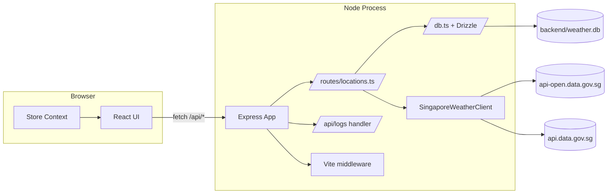
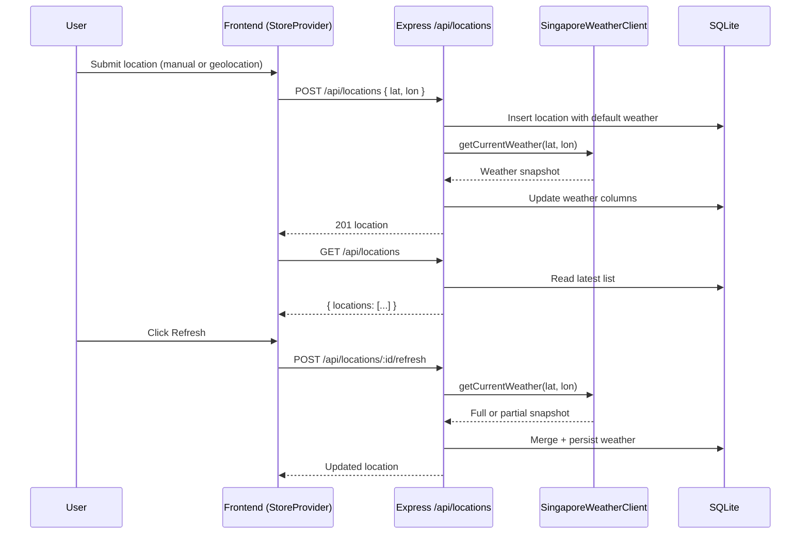

# Architecture

The application runs as a single Node process in development. Express handles API routes and mounts Vite middleware to serve the React app. The API persists location snapshots in SQLite and enriches weather data from data.gov.sg.

## Runtime Topology

## Request Flow: Add And Refresh

## Caching Notes

- Forecast area metadata is cached in-memory in the backend router for 10 minutes.
- The frontend also caches forecast areas for 10 minutes and deduplicates concurrent requests.
- If upstream forecast-area fetch fails after a successful fetch, stale cached areas are served with `stale: true`.

## Error Handling

- Weather provider failures are mapped to `WeatherProviderError`.
- Location refresh returns `502` for provider errors.
- New location creation still returns `201` even if immediate refresh fails, so coordinates are not lost.
- Unhandled request errors are logged and returned as `500` with `{ detail: "Internal server error" }`.
