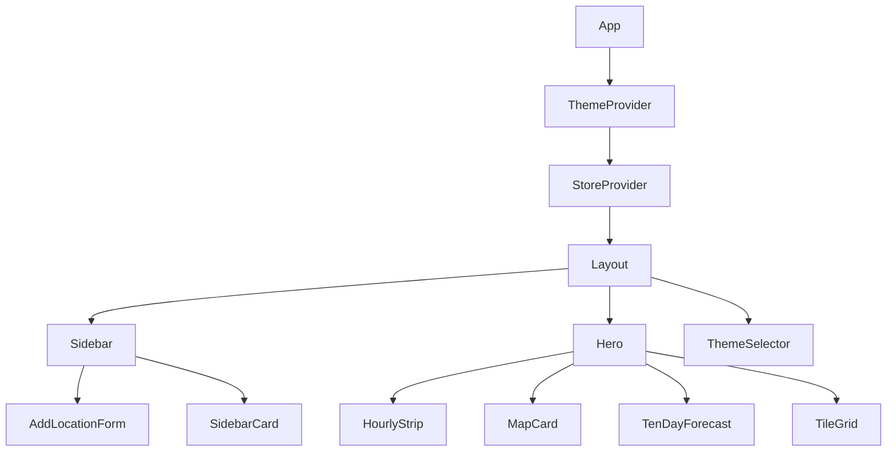

# Frontend

Frontend entry point is `frontend/src/App.tsx`, which composes:

- `ThemeProvider` for visual theme state
- `StoreProvider` for data and actions
- `Layout` for shell (`Sidebar` + `Hero` + `ThemeSelector`)

## Component Composition

## Store State

`frontend/src/state/store.tsx` is the central state container.

State fields:

- `locations`
- `selectedId`
- `isAdding`
- `isLoading`
- `refreshingId`
- `error`

Primary actions:

- `create(payload)`
- `refresh(id)`
- `deleteLocation(id)`
- `setAdding(bool)`
- `select(id)`

## Frontend API Layer

`frontend/src/api.ts` uses relative `/api` requests and exposes:

- `listLocations`
- `createLocation`
- `deleteLocation`
- `refreshLocation`
- `fetchForecastAreas`
- `logInteraction`

Forecast-area fetches are cached client-side for 10 minutes and coalesced through a shared pending promise.

## Location Add Flow

`AddLocationForm` supports:

- Device geolocation (`navigator.geolocation`)
- Manual coordinate entry

For either source, the flow:

1. Normalizes coordinates to 4 decimals.
2. Fetches forecast areas when available.
3. Snaps to nearest forecast area coordinates.
4. Detects duplicates before create.
5. Calls store `create` with resolved coordinates.

When forecast metadata is unavailable, out-of-bounds coordinates are rejected client-side.

## Dashboard Rendering Rules

`Hero` renders based on available weather fields:

- No selected location: empty-state prompt + map card.
- Selected location: location headline, condition, and update timestamp.
- `HourlyStrip` uses `forecast_periods` with fallback from `valid_period_text` + `condition`.
- `TenDayForecast` appears when `daily_forecast` has items.
- `TileGrid` appears when at least one supplementary metric exists (air quality, wind, UV, rainfall, humidity, temperature, forecast high).

`MapCard` displays all saved locations with custom markers and supports fullscreen expansion.
