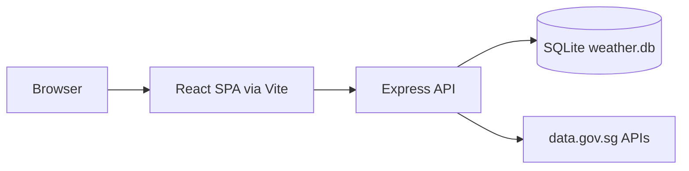

# Weather Starter

Weather Starter is a Singapore-focused weather tracker built with:

- Node + Express backend
- React + Vite frontend
- SQLite persistence through Drizzle ORM
- data.gov.sg weather feeds as the upstream source

Use this documentation to understand how the app is wired today.

## System At A Glance

## Docs Map

- [Architecture](./architecture/) explains runtime topology and request flow.
- [Backend API](./backend-api/) documents routes, validation, and update behavior.
- [Frontend](./frontend/) describes state management, UI composition, and user interactions.
- [Data Model](./data-model/) documents persisted schema and weather snapshot shape.
- [Development](./development/) covers commands, environment variables, and verification workflow.