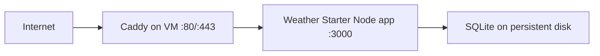

# Compute Engine Deployment

This app is designed to run well on a single Google Compute Engine VM because the backend serves the built frontend and persists data to a local SQLite database.

## Recommended Topology



- Google Cloud project: `automatic-ace-488412-a7`
- Project number: `521506040142`
- Recommended free-tier region: `us-central1`
- Recommended VM: non-preemptible `e2-micro`
- Recommended disk: standard persistent disk within the free-tier allowance

## Why Compute Engine

- The app already builds as one deployable unit from the repo root.
- The backend in `backend/src/server.ts` serves both `frontend/dist` and `/api`.
- The SQLite store in `backend/src/db.ts` expects durable local storage.
- A VM avoids the Cloud Run and serverless storage tradeoffs for this architecture.

## VM Creation

You can run VM creation manually, or use the helper script:

```bash
npm run gcp:vm:create
```

The script wraps the same `gcloud` commands below and is safe to rerun.

Environment variables you can override:

- `PROJECT_ID` (default `automatic-ace-488412-a7`)
- `INSTANCE_NAME` (default `weather-starter-vm`)
- `ZONE` (default `us-central1-a`)
- `MACHINE_TYPE` (default `e2-micro`)
- `DISK_SIZE_GB` (default `30`)
- `FIREWALL_RULE` (default `allow-weather-starter-web`)

Set your project locally:

```bash
gcloud config set project automatic-ace-488412-a7
```

Create the VM in a free-tier region:

```bash
gcloud compute instances create weather-starter-vm \
  --project=automatic-ace-488412-a7 \
  --zone=us-central1-a \
  --machine-type=e2-micro \
  --network-interface=network-tier=PREMIUM,subnet=default \
  --maintenance-policy=MIGRATE \
  --provisioning-model=STANDARD \
  --create-disk=auto-delete=yes,boot=yes,device-name=weather-starter-vm,image-family=debian-12,image-project=debian-cloud,mode=rw,size=30,type=pd-standard \
  --tags=http-server,https-server
```

Allow web traffic if the default firewall rules are not already present:

```bash
gcloud compute firewall-rules create allow-weather-starter-web \
  --project=automatic-ace-488412-a7 \
  --direction=INGRESS \
  --priority=1000 \
  --network=default \
  --action=ALLOW \
  --rules=tcp:80,tcp:443 \
  --target-tags=http-server,https-server
```

## Server Bootstrap

You can bootstrap manually, or use the helper script:

```bash
REPO_URL='<your-git-repo-url>' npm run gcp:vm:bootstrap
```

The bootstrap script installs Node + Caddy, clones or updates the repo, runs the build, installs a `systemd` service, and configures Caddy.

If you see `debconf` frontend warnings during package installation over SSH, those are usually non-fatal in non-interactive terminals. Treat the run as failed only when a command exits with a hard error (for example `Permission denied` on filesystem operations).

Environment variables you can override for bootstrap:

- `PROJECT_ID` (default `automatic-ace-488412-a7`)
- `INSTANCE_NAME` (default `weather-starter-vm`)
- `ZONE` (default `us-central1-a`)
- `REPO_URL` (required)
- `BRANCH` (default `main`)
- `APP_DIR` (default `/opt/weather-starter`)
- `DATA_DIR` (default `/var/lib/weather-starter`)
- `PORT` (default `3000`)
- `HOST` (default `127.0.0.1`)
- `DOMAIN` (optional, for HTTPS with Caddy)

If a bootstrap attempt fails part-way, fix the cause and rerun the same command. The script is designed to be rerunnable.

SSH into the VM:

```bash
gcloud compute ssh weather-starter-vm --zone=us-central1-a
```

Install Node.js 22 and supporting packages:

```bash
curl -fsSL https://deb.nodesource.com/setup_22.x | sudo -E bash -
sudo apt-get install -y nodejs git caddy
```

Create app and data directories:

```bash
sudo mkdir -p /opt/weather-starter /var/lib/weather-starter
sudo chown -R "$USER":"$USER" /opt/weather-starter /var/lib/weather-starter
```

Clone the repo and build the app:

```bash
git clone <your-repo-url> /opt/weather-starter
cd /opt/weather-starter
npm install
npm run build
```

## Runtime Configuration

The recommended runtime settings on the VM are:

- `NODE_ENV=production`
- `PORT=3000`
- `HOST=127.0.0.1`
- `DATABASE_PATH=/var/lib/weather-starter/weather.db`

`HOST=127.0.0.1` keeps the Node app private to the VM when Caddy is handling public traffic.

If you want to expose Node directly without a reverse proxy, set `HOST=0.0.0.0` instead and open only the port you intend to use.

## systemd Service

Copy the example service file in `ops/systemd/weather-starter.service.example` to `/etc/systemd/system/weather-starter.service`, replace `DEPLOY_USER` with your VM user, and then enable it:

```bash
sudo cp ops/systemd/weather-starter.service.example /etc/systemd/system/weather-starter.service
sudo sed -i "s/DEPLOY_USER/$USER/" /etc/systemd/system/weather-starter.service
sudo systemctl daemon-reload
sudo systemctl enable --now weather-starter
sudo systemctl status weather-starter
```

## Caddy Reverse Proxy

Detailed setup, domain, HTTPS, and troubleshooting steps are documented in `docs/caddy_setup.md`.

For an external IP only, a minimal Caddy config can listen on port 80. For a real domain, replace `your-domain.example` in `ops/caddy/Caddyfile.example` and install it:

```bash
sudo cp ops/caddy/Caddyfile.example /etc/caddy/Caddyfile
sudo systemctl reload caddy
```

Caddy will automatically manage HTTPS when the hostname resolves to the VM.

## Redeploy Flow

For routine updates, prefer the redeploy helper:

```bash
npm run gcp:vm:redeploy
```

The script pulls the selected branch, installs deps, rebuilds, and restarts `weather-starter`.

Environment variables you can override for redeploy:

- `PROJECT_ID` (default `automatic-ace-488412-a7`)
- `INSTANCE_NAME` (default `weather-starter-vm`)
- `ZONE` (default `us-central1-a`)
- `BRANCH` (default `main`)
- `APP_DIR` (default `/opt/weather-starter`)

## GitHub Actions Deploy on Push

If you want the VM to update automatically on every push to `main`, use the GitHub Actions workflow at [.github/workflows/deploy-vm.yml](../.github/workflows/deploy-vm.yml).

This workflow does not use `gcloud compute ssh`, so it avoids the interactive `google_compute_engine` key generation prompt entirely. Instead, it uses a dedicated SSH key pair that you create once for deployment.

Required GitHub repository secrets:

- `VM_HOST` - the VM external IP or hostname
- `VM_USER` - the SSH user on the VM
- `VM_PORT` - optional SSH port, defaults to `22`
- `VM_SSH_PRIVATE_KEY` - the private key with no passphrase

One-time setup:

1. Generate a deploy key pair locally, for example with `ssh-keygen -t ed25519 -f ~/.ssh/weather-starter-deploy -N ''`.
2. Add the public key to the VM user's `~/.ssh/authorized_keys`.
3. Save the private key in the GitHub repo secret `VM_SSH_PRIVATE_KEY`.
4. Save the VM IP or hostname in `VM_HOST` and the SSH user in `VM_USER`.

On each push, the workflow syncs the checked-out source to the VM over SSH, runs `npm ci`, rebuilds the app, restarts `weather-starter`, and checks `http://127.0.0.1:3000/health` on the VM.

If `sudo` prompts for a password on the VM, grant the deploy user passwordless access for the `systemctl` commands or adjust the workflow commands accordingly.

From the VM:

```bash
cd /opt/weather-starter
git pull
npm install
npm run build
sudo systemctl restart weather-starter
```

## Verification

Check the service locally on the VM:

```bash
curl http://127.0.0.1:3000/health
```

Check the public endpoint:

```bash
curl http://YOUR_EXTERNAL_IP/health
```

Validate persistence:

1. Add a location through the UI or API.
2. Restart the service with `sudo systemctl restart weather-starter`.
3. Confirm the location still exists.
4. Reboot the VM and confirm the location still exists.

## Backups

For a simple demo backup flow, stop the app briefly, copy the database file, then start the app again:

```bash
sudo systemctl stop weather-starter
cp /var/lib/weather-starter/weather.db \
  /var/lib/weather-starter/weather.db.$(date +%F-%H%M%S).bak
sudo systemctl start weather-starter
```

For lower-risk recovery later, add persistent disk snapshots in GCP and keep occasional copied SQLite backups as well.

## Script Files for Learning

- `scripts/gcp/provision-vm.sh`:
  - Creates the VM and firewall rule.
  - Re-runnable with existence checks.
  - Prints the external IP and next step.
- `scripts/gcp/bootstrap-vm.sh`:
  - Installs OS packages and Node 22.
  - Clones or updates the repo on the VM.
  - Builds the app and configures `systemd` + Caddy.
- `scripts/gcp/redeploy-vm.sh`:
  - Pulls latest code from the selected branch.
  - Rebuilds and restarts the app service.

If you want to understand each step deeply, open these scripts and run them one at a time.