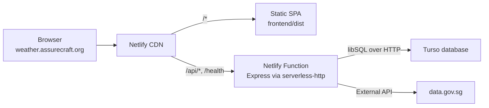

# Deploying to Netlify

The app deploys to Netlify as two pieces from one repository:

- **Static SPA** — the React app is built to `frontend/dist` and served from
  Netlify's CDN.
- **API function** — the entire Express app runs inside a single Netlify Function
  (`netlify/functions/api.ts`), wrapped with `serverless-http`. `netlify.toml`
  redirects `/api/*` and `/health` to it.

Data lives in a **Turso (libSQL)** database instead of a local SQLite file, because
Netlify Functions are ephemeral and have no persistent filesystem.



## Prerequisites

1. A [Netlify](https://netlify.com) account.
2. A [Turso](https://turso.tech) account + the CLI (`curl -sSfL https://tur.so/install.sh | bash`).
3. DNS for `assurecraft.org` managed in Cloudflare (for the custom domain).

## 1. Provision the database (Turso)

```bash
turso auth login
turso db create weather-starter
turso db show weather-starter --url      # -> TURSO_DATABASE_URL (libsql://...)
turso db tokens create weather-starter   # -> TURSO_AUTH_TOKEN (eyJ...)
```

Put both values in a local `.env` (see `.env.example`). The app connects to Turso
when `TURSO_DATABASE_URL` is set and `NODE_ENV !== 'test'`; otherwise it falls back
to a local SQLite file for dev and tests.

Apply the schema to the remote database:

```bash
npm run db:migrate:remote
```

This is idempotent (tracked in `__drizzle_migrations`) and must be re-run after any
new migration is generated with `npm run db:generate`.

## 2. Create the Netlify site

In the Netlify dashboard: **Add new site → Import an existing project**, pick the
repository, and confirm the build settings (they come from `netlify.toml`):

| Setting | Value |
|---|---|
| Base directory | repo root (leave blank) |
| Build command | `npm run build` |
| Publish directory | `frontend/dist` |
| Functions directory | `netlify/functions` |

> The repo uses npm **workspaces**. If the Netlify CLI or dashboard prompts to pick
> a sub-project (frontend/backend), choose the **repository root** so the root
> `netlify.toml` is used.

## 3. Set environment variables

Site configuration → **Environment variables**:

| Variable | Value |
|---|---|
| `TURSO_DATABASE_URL` | `libsql://...` from step 1 |
| `TURSO_AUTH_TOKEN` | `eyJ...` from step 1 |
| `NODE_ENV` | `production` |
| `WEATHER_API_KEY` | optional data.gov.sg key for higher rate limits |

`NODE_ENV=production` matters: it enables the helmet CSP, the `Secure` session
cookie, and `trust proxy` so the rate limiter reads the real client IP behind the
Netlify proxy.

## 4. Deploy and verify

Trigger a deploy (push to the default branch or **Trigger deploy**). Then:

```bash
curl -I https://<your-site>.netlify.app/health        # 200
curl -s  https://<your-site>.netlify.app/api/locations # {"locations":[...]}
```

Create a location in the UI and reload — it should persist (it is stored in Turso).

## 5. Custom domain (Cloudflare DNS → Netlify)

Target: `https://weather.assurecraft.org`.

1. **Netlify** → Domain management → **Add a domain** → `weather.assurecraft.org`.
   Note the CNAME target it shows (`<your-site>.netlify.app`).
2. **Cloudflare** → `assurecraft.org` → DNS → **Add record**:
   - Type `CNAME`, Name `weather`, Target `<your-site>.netlify.app`
   - Proxy status **DNS only (grey cloud)** — lets Netlify issue the TLS certificate
   - TTL Auto
3. **Netlify** provisions HTTPS automatically within a few minutes. Set the custom
   domain as **primary** (auto-redirects http→https and `*.netlify.app`→custom domain).

**Optional — Cloudflare proxy (orange cloud):** only after the cert is green, flip the
record to Proxied and set SSL/TLS → Overview → **Full (strict)** (never "Flexible").
If API responses look stale, add a Cloudflare cache rule to **bypass cache** for
`weather.assurecraft.org/api/*`.

Verify:

```bash
dig +short weather.assurecraft.org
curl -I https://weather.assurecraft.org/health
```

## Local development with the Netlify build

`npm run dev` remains the normal dev loop (Express + Vite via Portless, local SQLite).
To exercise the production build locally, set the Turso vars and run
`npm run build` — the compiled function can then be invoked exactly as Netlify runs it.

## Notes and limitations

- **Migrations never run on the request path.** `db.ts` auto-migrates only the local
  file (dev/tests); the remote database is migrated out-of-band via
  `npm run db:migrate:remote`.
- **In-memory state resets per cold start.** The rate limiter and the forecast-area
  cache are per-instance. This is acceptable for current usage; back them with Turso
  or Netlify Blobs if stricter behavior is needed.
- **`vite` is externalized** in `netlify.toml` because `server.ts`'s dev-only branch
  references it; the function runs with `serveFrontend: false`, so it is never loaded.
